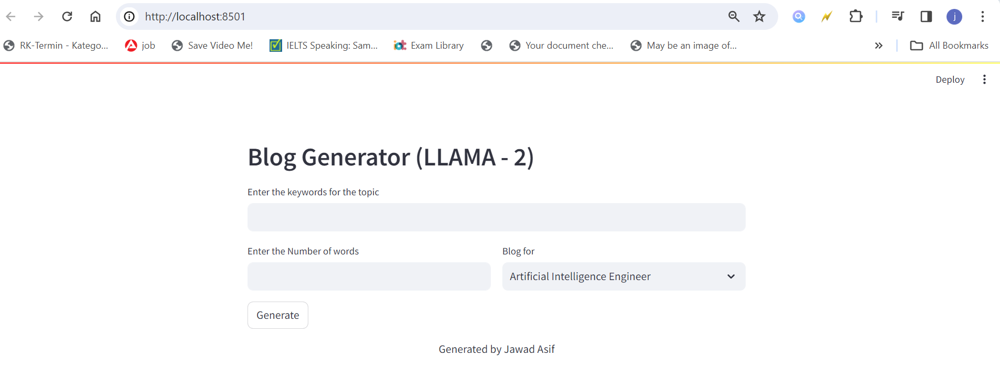

[](https://pypi.org/project/zenml/)


## Generating Blog with help of LLAMA 2
In this project, a language model that's really good at generating text. I got the model from the website, making sure it's all legit. Now, when someone uses my app, they can type in some keywords, say how many words they want, and pick a writing style like for a job profile. LLAMA2 then works its magic and creates a custom blog response based on what they entered.


**LLAMA-2**:

Llama 2 was pretrained on publicly available online data sources -  Is a family of generative text models that are optimized for assistant-like chat use cases or can be adapted for a variety of natural language generation tasks. 
You can download model from Huggin face  [github link](https://huggingface.co/TheBloke/Llama-2-7B-Chat-GGML/tree/main)

## Demo




## Dependencies
- Python (>=3.8)
- sentence-transformers
- uvicorn
- ctransformers
- langchain
- python-box
- streamlit


## Installation
1. Clone the repository:

```bash
git clone https://github.com/asifjawad/LLM_blog_generation_using_llama2.git
```

You can also install the dependencies by installing the pip command.

```bash
pip install -r requirements.txt

```

## Setup
1. Download the LLAMA-2 model from [official website](https://llama2-models.com).
2. Save the model file (`llama-2-7b-chat.ggmlv3.q8_0.bin`) in the `models/` directory.


The core of the whole thing is a function called `get_response`. It's like the conductor of an orchestra, coordinating LLAMA2 to make sure everything sounds just right. People can type in their topic, set the word count, and choose a writing style—easy peasy.


I've set up a neat Streamlit app so users can interact with it. They type in keywords, choose how many words they want, and pick a style from a dropdown. LLAMA2 then gets to work and generates a blog response on the spot.

## Usage
1. Run the Streamlit app:
   
```bash
streamlit run app.py
```


## Contributing
- Fork the repository
- Create a new branch: `git checkout -b feature/new-feature`
- Commit your changes: `git commit -m 'Add new feature'`
- Push to the branch: `git push origin feature/new-feature`
- Submit a pull request


## Docker
Otherwise, you can also use docker to run the application.
## Running with Docker

### Prerequisites
- [Docker](https://www.docker.com/) installed on your machine.

### Steps

1. Clone the repository:
```bash
https://github.com/asifjawad/LLM_blog_generation_using_llama2.git
cd your-project
```

Overall, it's a cool project where LLAMA2 does its thing, and users get to see their unique blog responses in a simple and friendly app.


